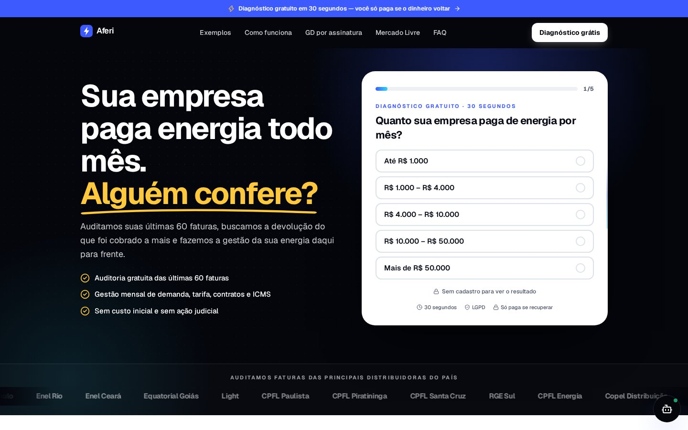
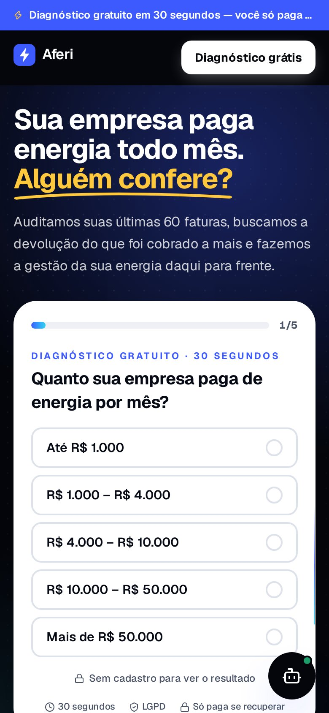
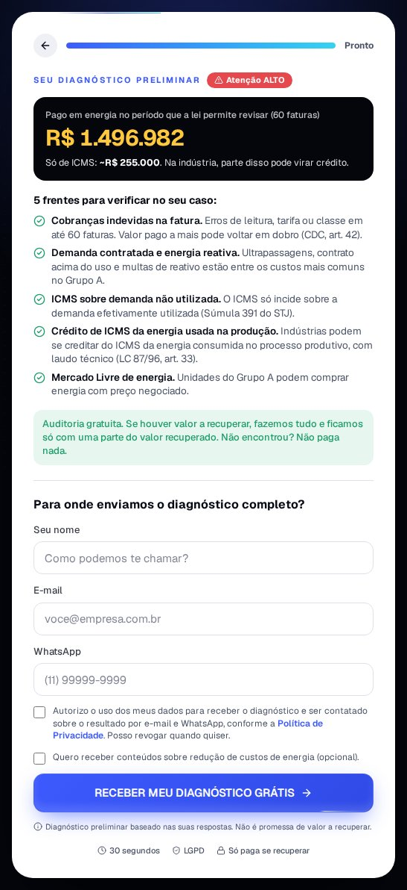

# Aferi

**Auditoria e gestão de energia para empresas.**

[**Ver o site ao vivo →**](https://aferi-energia.vercel.app)

<table>
  <tr>
    <td width="42%"></td>
    <td width="58%"></td>
  </tr>
</table>

## Sobre

Plataforma B2B que transforma a conta de energia em diagnóstico. O visitante responde
a um quiz rápido, recebe uma leitura preliminar do seu caso e envia a fatura para
auditoria. Do outro lado, a equipe acompanha cada oportunidade em um painel.

## Destaques

- Diagnóstico em quiz com resultado personalizado
- Leitura automática de faturas de energia
- Atendimento com IA
- Painel de leads e automações de contato
- Conformidade com a LGPD

## Tecnologias

Next.js · React · TypeScript · Tailwind CSS · PostgreSQL · IA generativa · Vercel

## Direitos

© 2026 maricobello. Todos os direitos reservados.
Código publicado apenas para visualização em portfólio. Não é permitido usar, copiar,
modificar ou distribuir sem autorização. Veja [LICENSE](LICENSE).
